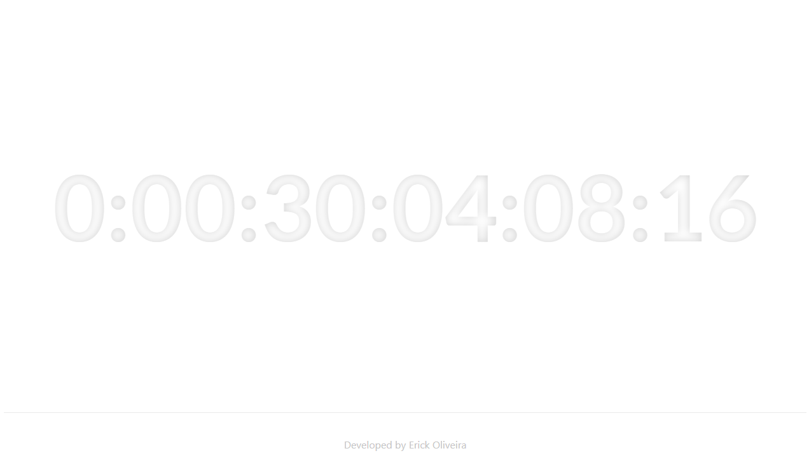

# [Nicolas' Lifetime](https://nicolaslifetime.vercel.app/)



A website with the countdown to my cousins birthday and how long he has lived.

This idea came to me because he has just been born in the present time (06/2021) and i wanted to program something simple and test some libraries.

# Links

- [Lifetime](https://nicolaslifetime.vercel.app/)
- [Birthday Countdown](https://nicolaslifetime.vercel.app/birthday)

# My process

## Build with

- [Next.js](https://nextjs.org/) - React framework
- [React](https://reactjs.org/) - JS library
- [Moment](https://momentjs.com/docs/) - JS Library
- [Static Generation](https://nextjs.org/docs/basic-features/pages#static-generation-without-data)
- Text shadow
- Semantic HTML5 markup
- Flexbox

## What I learned

I wanted to test the library moment for some time. I used it in the internship I'm currently (jun/2021) working so I used this oportunity to practice a little.

In this project I learned a lot about moment, I'll use in the future for sure. It makes everything a lot easier.

I also took the oportunity to take a look at text-shadow because makes a cool pressed effect.

The part that was a bit annoying was the day of the counters because months don't have the same amount of days and I had to make a little logic to make work.

```typescript
let tempDate: number | Moment = 0;

// birthDateArray[2]: day
if (moment().date() < birthDateArray[2]) {
  tempDate = moment([
    moment().year(),
    moment().month(),
    birthDateArray[2],
    birthDateArray[3],
    birthDateArray[4],
    birthDateArray[5],
  ]);

  tempDate = Math.abs(Math.floor(moment().diff(tempDate, "days")));
} else {
  tempDate = moment([
    moment().year(),
    moment().month(),
    birthDateArray[2],
    birthDateArray[3],
    birthDateArray[4],
    birthDateArray[5],
  ]).add(1, "month");

  tempDate = Math.abs(Math.floor(moment().diff(tempDate, "days")));
}
```

## Author

- Linkedin - [@erick-t-oliveira](https://www.linkedin.com/in/erick-t-oliveira/)
- Github - [Erick_Tomaz_ET](https://github.com/Erick-Oliveira-ET)
- Frontend Mentor - [@Erick-Oliveira-ET](https://www.frontendmentor.io/profile/Erick-Oliveira-ET)
- Instagram - [@erick_tomaz_kz](https://www.instagram.com/erick_tomaz_kz/)

I know there's place to improve and I accept suggestions.

Thank you for the attention.
